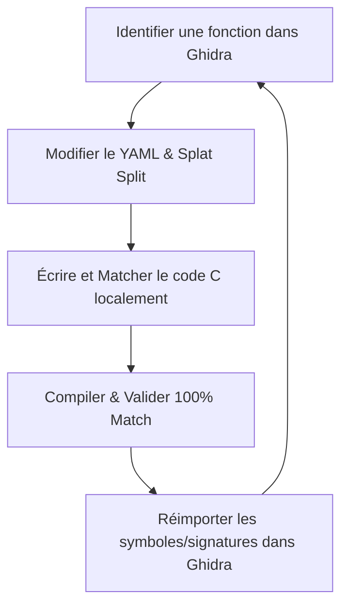

# Workflow de Décompilation (C-First / Local-First)

Ce document synthétise la boucle de travail itérative du projet. 
La règle d'or est que **le code source local (les fichiers C, la configuration Splat, et les fichiers de symboles locaux) est l'unique source de vérité**. Ghidra sert d'outil d'analyse interactif et est mis à jour depuis le code local.

> [!IMPORTANT]
> **Sécurité de `manual_syms.txt`**
> Le fichier `config/symbols/SCES_008.68.manual_syms.txt` est votre registre de symboles personnalisés (variables globales, fonctions validées, registres, etc.). **Aucun script ni commande de build ne modifiera ou n'écrasera jamais ce fichier automatiquement.** Il est exclusivement géré par vous. Veillez à le maintenir rigoureusement à jour lors de vos renommages.


---

## Le Workflow Général (Boucle de Décompilation)



---

## Phase A : Configuration & Découpage (Splat Split)

**Objectif :** Isoler une fonction assembleur non-décompilée pour commencer à travailler dessus.

1. Identifie l'offset ou l'adresse de la fonction cible dans Ghidra.
   *(Utilise `./tools/vram_to_fileoff.py <adresse>` pour trouver le bon offset de fichier).*
2. Dans le YAML (`config/splat/SCES_008.68.yaml`), déclare la fonction sous `subsegments` en changeant son type de `asm` vers `c`.
3. Lance le split pour générer le fichier C vide dans `src/` :
   ```bash
   ff7-split
   ```

---

## Phase B : Décompilation & C-Matching

**Objectif :** Écrire le code C et obtenir une équivalence stricte au niveau des instructions compilées (byte-to-byte parity).

> [!WARNING]
> **Règle d'Or : Bottom-Up (Leaf Functions First)**
> Travaille toujours de bas en haut : commence par décompiler les fonctions feuilles (qui n'appellent aucune autre fonction), valide-les, puis remonte d'un niveau. Une seule fonction dont la taille générée diffère de l'originale décalera toutes les adresses suivantes dans le binaire.

1. Rédige le code C dans le fichier généré sous `src/SCES_008.68/`.
2. Renomme les variables locales, globales et pointeurs avec des noms descriptifs directement dans le fichier C.
3. Si la fonction utilise des variables globales, des constantes, ou des adresses de pointeurs non-déclarées dans les fichiers C, ajoutez-les immédiatement dans `config/symbols/SCES_008.68.manual_syms.txt`. **Il est crucial de maintenir ce fichier à jour rigoureusement à chaque fois qu'un nouveau symbole global est identifié ou renommé**, car c'est lui qui sert de base de référence pour le linker et pour la synchronisation automatique vers Ghidra.

4. Lance la vérification interactive avec `asm-differ` :
   ```bash
   ff7-diff <nom_de_la_fonction>
   ```
   *(Ce script recompile et compare automatiquement à chaque fois que tu sauvegardes ton fichier C).*
5. **Permuteur (Optionnel) :** Si tu es bloqué sur les dernières instructions ou l'optimisation des registres :
   - Importe la fonction : `ff7-perm-import <nom_fonction>`.
   - Modifie uniquement `nonmatchings/<nom_fonction>/base.c` avec les macros de permutation.
   - Lance le permuteur : `ff7-perm <nom_fonction> --stop-on-zero`.
   - Copie la solution trouvée dans ton fichier `src/` d'origine.
6. Une fois que la fonction matche à 100%, passe à la fonction supérieure dans la hiérarchie.

---

## Phase C : Rebuild & Synchronisation Ghidra

**Objectif :** Recompiler le projet globalement et mettre à jour la base de données Ghidra pour que l'analyse interactive reste alignée.

1. Recompile le projet complet et vérifie que tout est vert :
   ```bash
   ff7-build && ff7-check
   ```
   *(Le résultat final doit être un **100% byte-for-byte match** avec le binaire d'origine).*
2. **Suivi de la progression (Optionnel) :** Pour afficher le pourcentage exact du binaire réécrit en C et en HASM :
   ```bash
   ff7-progress
   ```
3. **Synchronisation vers Ghidra :** Une fois le binaire compilé et validé, ouvre Ghidra et exécute le script :

   **`ImportSplatSymbols.java`** (via le *Script Manager* de Ghidra).
   - Ce script va lire tes fichiers locaux `manual_syms.txt`, `sys_syms.txt`, et le fichier de mapping compilé `build/SCES_008.68.map`.
   - Il va renommer automatiquement toutes les fonctions et variables sous Ghidra, et **appliquer automatiquement les vraies signatures C** (arguments et types de retour) extraites de tes fichiers `.c` locaux.
   - Ton environnement Ghidra est maintenant parfaitement propre et à jour !

---

## Phase D : Intégration Ghidra-First (Cas particulier)

**Objectif :** Si tu as fait un gros travail de renommage directement dans Ghidra (sur des fonctions non encore décompilées) et que tu veux en extraire les symboles :

1. Dans Ghidra, exécute le script `ExportSplatSymbols.java` depuis le *Script Manager*.
   - Cela va mettre à jour le fichier `SCES_008.68.symbols.from_ghidra.txt`.
2. Lance le nettoyage pour filtrer les symboles et éviter les doublons avec tes définitions manuelles :
   ```bash
   ff7-clean-syms
   ```
3. Fais ton split `ff7-split` pour que Splat applique ces nouveaux noms lors du découpage assembleur.

---

## Phase E : Tests de non-régression & Overlays

1. **duckstation / ISO :** Pour construire une ISO modifiée et tester en émulateur :
   ```bash
   ff7-pack
   ```
2. **Overlays :** Une fois le binaire principal maîtrisé, applique la même logique en créant des profils YAML spécifiques (ex: `BATTLE.X.yaml`) pour décompiler les overlays.
